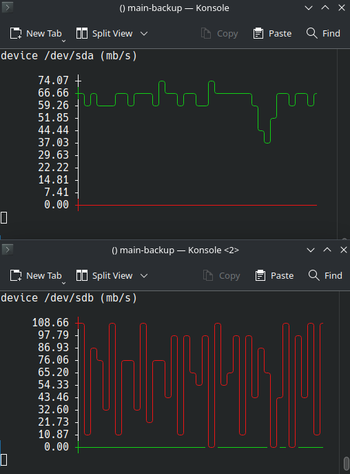

# monitor disk activity



## install

```sh
git clone https://github.com/devel0/monitor-disk-activity.git
cd monitor-disk-activity
npm i
npm run build
```

## usage

```sh
node dist /dev/DISK
```

or use the script

```sh
monitor-disk /dev/DISK
```

## references

- [typescript template](https://github.com/sezRR/nodejs-typescript-template/tree/7739711b5cb735632878279a55ffb6de02ebe07f)
- [asciichart](https://github.com/kroitor/asciichart)
